# Projet Étudiant : "Minecraft Secure Cluster"

**Lien Projet GitLab** : gitlab.com/Poulereaper/minecraft-secure-server-k8s

## Objectif 🎯

Déployer un serveur Minecraft sécurisé dans Kubernetes avec une CI/CD contrôlée par RBAC.  

**Stack** : GitLab CI + Kind + Trivy/Cosign + Kubernetes RBAC  

**Outils** : Helm, Kubectl, Kind, Docker


## Livrables Attendus 📦

1. Dépôt GitLab avec code fonctionnel envoyé par mail à ***eloutsch@omnesintervenant.com*** [:fontawesome-solid-paper-plane:](mailto:eloutsch@omnesintervenant.com). Mon user gitlab est [**@etyy**](https://gitlab.com/etyy)

2. Documentation des choix de sécurité

**RBAC (Role-Based Access Control)**

Le projet implémente un modèle RBAC strict pour limiter les privilèges :

- Service Account ci-deployer dédié uniquement au déploiement
- Rôle limité aux ressources strictement nécessaires (deployments, services)
- Verbes d'API restreints au minimum requis dans le namespace minecraft
- Token d'accès sécurisé stocké de manière chiffrée dans GitLab CI

**Namespace isolation**

- Utilisation d'un namespace dédié minecraft pour isoler les ressources
- GitLab Runner dans un namespace séparé gitlab-runner
- Limite la portée des privilèges et l'impact potentiel d'une compromission

**Image de base minimaliste**

- Utilisation de eclipse-temurin:21.0.7_6-jdk - une image Java officielle et maintenue
- Version spécifique fixée pour éviter les mises à jour automatiques non contrôlées

**Bonnes pratiques Docker**

- Installation des dépendances minimales (--no-install-recommends)
- Nettoyage après installation (apt-get clean, rm -rf /var/lib/apt/lists/*)
- Conteneur non-root (par défaut avec l'image temurin)
- Ressources limitées (mémoire du server fixée à 1024M)

**Vérification du Dockerfile**

- Analyse statique avec Hadolint pour détecter les mauvaises pratiques
- Seuil d'erreur restrictif (rejet même pour les warnings)

**Signature d'image avec Cosign**

- Signature cryptographique des images pour garantir l'intégrité
- Utilisation de Sigstore pour la gestion des clés et la vérification
- Vérification de la signature avant déploiement

**Analyse de vulnérabilités**

- Scan de l'image avec Trivy pour détecter les CVE
- Configuration pour bloquer le pipeline en cas de vulnérabilités CRITIQUES
- Analyse complète des dépendances incluses dans l'image

**GitLab CI sécurisée**

- Variables sensibles masquées et protégées
- Token d'accès Kubernetes limité en privilèges
- Images de base à jour pour les étapes CI

**Configuration sécurisée**

- Conteneur isolé avec privilèges minimaux
- Exposition minimale des ports (uniquement 25565)
- Service NodePort configuré avec port spécifique (30565)

**Gestion des secrets**

- Secret Kubernetes pour l'authentification au registre d'images
- Variables d'environnement sécurisées pour les données sensibles
- Token RBAC stocké de manière sécurisée

3. Capture d'écran du serveur Minecraft accessible

Voir fin

4. Exemple de rejet de pipeline pour CVE critique

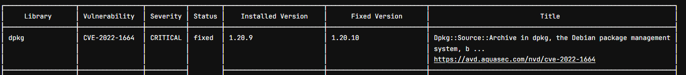

Solution mise en œuvre :
Pour résoudre cette vulnérabilité critique, nous avons mis à jour notre Dockerfile.
Cette mise à jour assure que la version de `dpkg` est mise à jour vers une version corrigée (1.20.10 ou supérieure), éliminant ainsi la vulnérabilité CVE-2022-1664.

## Architecture Globale 🏗️
```text
[GitLab CI] -> [Build/Lint/Sign/Scan] -> [Registry] -> [Kubernetes (Kind)]  -> Minecraft Server
```

## Étapes du Projet 🔍  

### **Infrastructure Kubernetes locale (Kind)**  

Fichier cluster.yml visible dans le dossier de ce projet :

```yaml title="cluster.yml"
kind: Cluster
apiVersion: kind.x-k8s.io/v1alpha4
nodes:
- role: control-plane
  extraPortMappings:
  - containerPort: 25565  # Port Minecraft
    hostPort: 25565
```

1. On lance ensuite le cluster Kubernetes local avec Kind

```bash
kind create cluster --config cluster.yml
```

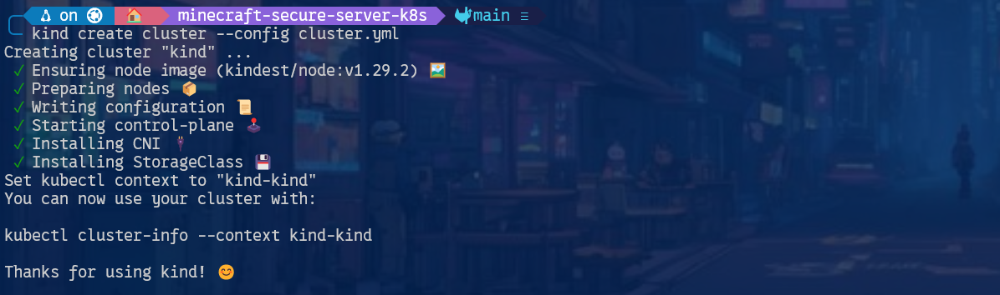

2. On vérifie que le cluster est prêt

```bash
kubectl get nodes
```
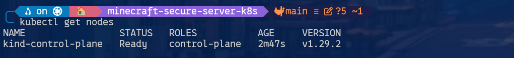

3. Créer le namespace `minecraft`

```bash
kubectl create namespace minecraft
```
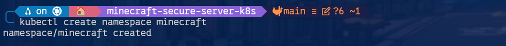


### **GitLab Runner dans le Cluster**
!!! tip
    Pour pouvoir déployer depuis Gitlab, il faut un gitlab runner dans votre cluster. :warning: Avant l'installation, il faut register le Runner dans votre projet. Settings > CI/CD > Runners > Décochez `Enable instance runners for this project` > Cliquer sur `New Projet Runner` > Dans `Tags` mettre `Kubernetes` > Cliquer sur `Create Runner` > Copier le token et le mettre dans la commande Helm. 

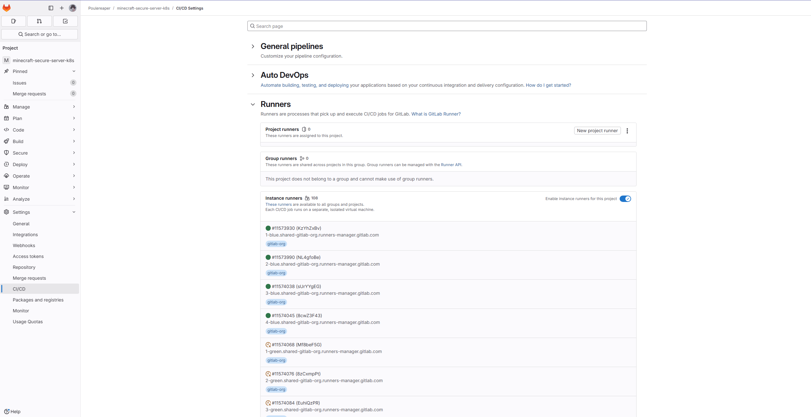
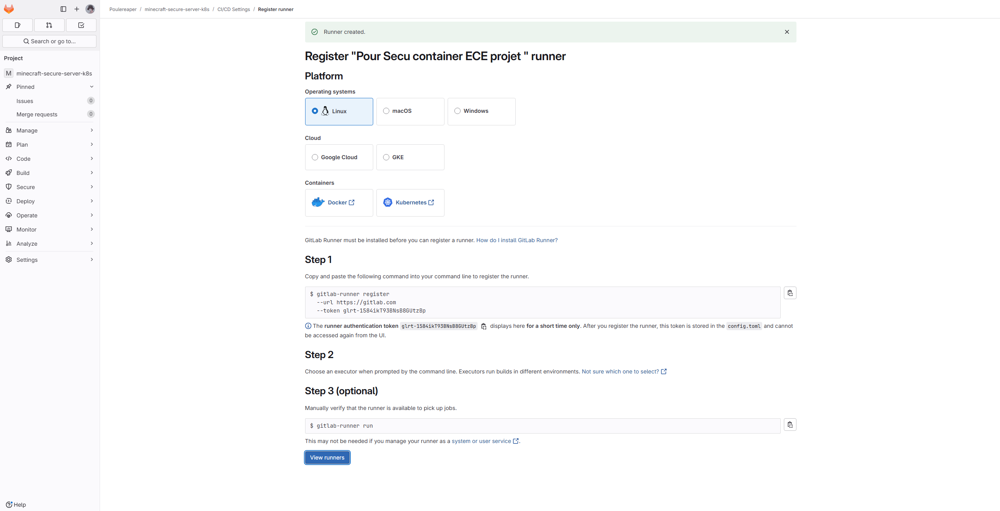
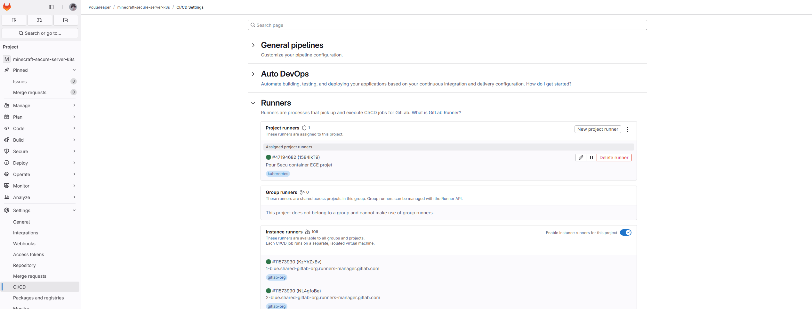

info du runner :
```
gitlab-runner register  --url https://gitlab.com  --token glrt-1584ikT93BNsB8GUtzBp
```

1. On ajoute le dépôt Helm qui contient le chart (gitlab-runner) pour pouvoir l’installer avec Helm.

```bash
helm repo add gitlab https://charts.gitlab.io
helm repo update
```

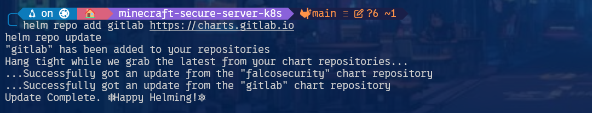

2. Puis on installe le Runner avec Helm.

```bash
helm install gitlab-runner gitlab/gitlab-runner \
  --set rbac.create=true \
  --namespace gitlab-runner \
  --create-namespace \
  --set serviceAccount.create=true \
  --set gitlabUrl=https://gitlab.com \
  --set runnerToken=glrt-1584ikT93BNsB8GUtzBp
```  

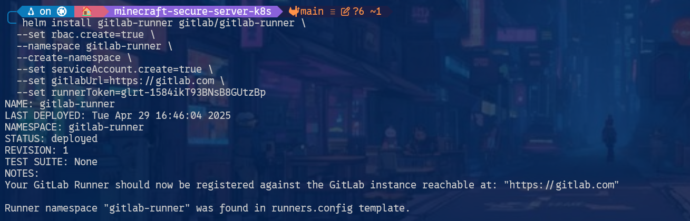

3. Enfin on vérifie que le Runner est bien installé.

```bash
kubectl get pods -n gitlab-runner
```

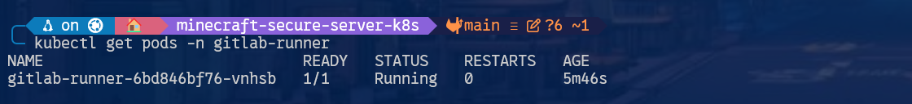


### **RBAC Pour la CI**

Fichier minecraft-rbac.yml visible dans me dossier de ce projet :

```yaml title="minecraft-rbac.yml"
apiVersion: v1
kind: ServiceAccount
metadata:
  name: ci-deployer
  namespace: minecraft
secrets:
- name: ci-deployer-token
---
apiVersion: rbac.authorization.k8s.io/v1
kind: Role
metadata:
  namespace: minecraft
  name: ci-deployer
rules:
- apiGroups: ["apps"]
  resources: ["deployments"]
  verbs: ["get", "list", "watch", "create", "update", "patch", "delete"]
- apiGroups: [""]
  resources: ["services"]
  verbs: ["get", "list", "watch", "create", "update", "patch", "delete"]
---
apiVersion: rbac.authorization.k8s.io/v1
kind: RoleBinding
metadata:
  name: ci-deployer-rolebinding
  namespace: minecraft
subjects:
- kind: ServiceAccount
  name: ci-deployer
  namespace: minecraft
roleRef:
  kind: Role
  name: ci-deployer-role
  apiGroup: rbac.authorization.k8s.io
---
apiVersion: v1
kind: Secret
metadata:
  name: ci-deployer-token
  namespace: minecraft
  annotations:
    kubernetes.io/service-account.name: "ci-deployer"
type: kubernetes.io/service-account-token
```
1. On doit d'abord appliquer les permissions pour la CI (RBAC).

```bash
kubectl apply -f kubernetes/minecraft-rbac.yml
```

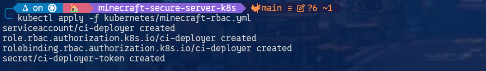

2. Ensuite il faut récupérer le token du serviceAccount pour pouvoir déployer dans Kubernetes.

```bash
# Récupérer le token automatiquement généré
kubectl -n minecraft get secret $(kubectl -n minecraft get sa ci-deployer -o jsonpath='{.secrets[0].name}') -o jsonpath='{.data.token}' | base64 -d > ci-deployer-token
```

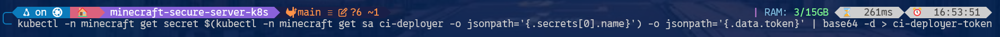

Voir fichier ci-deployer-token dans ce projet.


### **Ajouter le Token dans GitLab**
- Dans Settings > CI/CD > Variables.
- On fait add Variable.
- Key = CI_DEPLOY_TOKEN_K8S
- Value = contenu du fichier ci-deployer-token
- Options : Protected, Masked

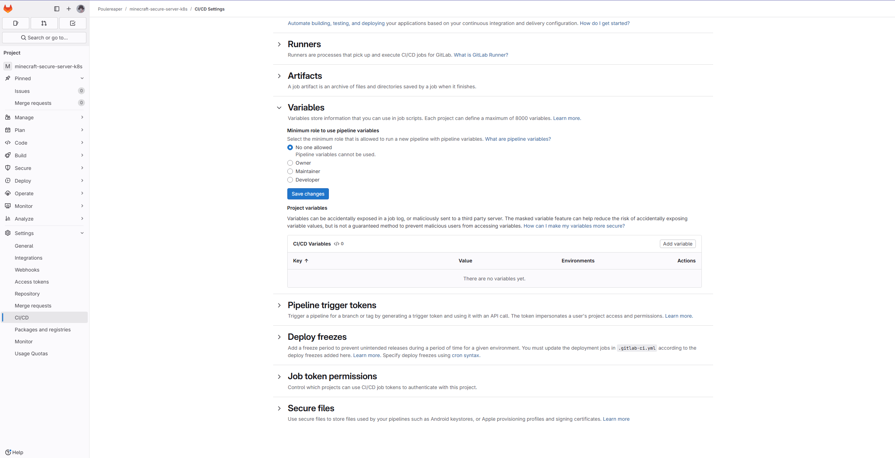
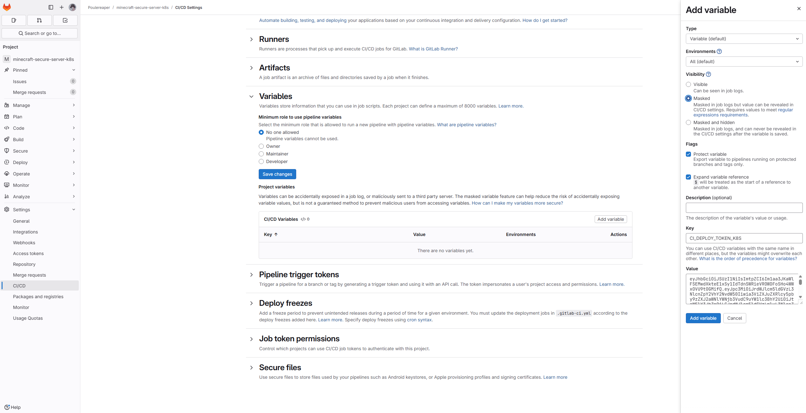
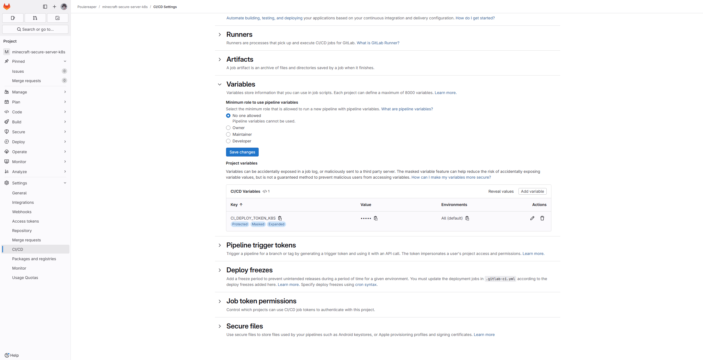

### **Dockerfile sécurisé**

Fichier Dockerfile visible dans me dossier de ce projet :

```Dockerfile
FROM eclipse-temurin:21.0.7_6-jdk

WORKDIR /minecraft

RUN apt-get update && \
    apt-get install -y --no-install-recommends curl && \
    curl -o server.jar https://launcher.mojang.com/v1/objects/145ff0858209bcfc164859ba735d4199aafa1eea/server.jar && \
    echo "eula=true" > eula.txt && \
    apt-get clean && \
    rm -rf /var/lib/apt/lists/*

EXPOSE 25565

CMD ["java", "-Xmx1024M", "-Xms1024M", "-jar", "server.jar", "nogui"]
```

On construit l'image Docker Minecraft localement pour tester.

```bash
docker build -t minecraft-server:latest .
```

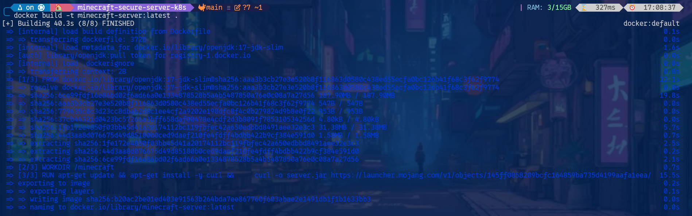

#### **Déploiement Kubernetes**
> Pour créer un pod il faut créer un déploiement qui permet de spécifier l'image, les ressources etc...

```yaml title="minecraft-deploy.yml"
apiVersion: apps/v1
kind: Deployment
metadata:
  name: minecraft
  namespace: minecraft
spec:
  selector:
    matchLabels:
      app: minecraft
  template:
    metadata:
      labels:
        app: minecraft
    spec:
      serviceAccountName: ci-deployer
      imagePullSecrets:
      - name: gitlab-registry-auth
      containers:
      - name: minecraft
        #image: registry.gitlab.com/Poulereaper/minecraft-secure-server-k8s:$CI_COMMIT_REF_SLUG
        image: ${CI_REGISTRY_IMAGE}:${CI_COMMIT_REF_SLUG}
        ports:
        - containerPort: 25565
```
:warning: Faite en sorte d'accéder depuis votre PC à votre serveur minecraft (il faut peut être créer une autre ressource...) 

En effet dans notre projet on a :
- Un cluster Kind avec un port-mapping configuré (25565)
- Un déploiement qui exécute votre serveur Minecraft
Mais il manque le "pont" qui relie les deux: comment le trafic entrant sur le port 25565 du cluster atteint-il notre pod Minecraft? C'est le rôle du Service.

Voir fichier kubernetes/minecraft-service.yml dans ce projet

```yml
apiVersion: v1
kind: Service
metadata:
  name: minecraft
  namespace: minecraft
spec:
  selector:
    app: minecraft
  ports:
  - port: 25565
    targetPort: 25565
    nodePort: 30565
    name: minecraft
  type: NodePort
```

#### **Pipeline GitLab CI**


```yaml title=".gitlab-ci.yml"
stages:
  - lint
  - build
  - verify
  - scan
  - deploy

# Étape 1 : Analyse du Dockerfile avec Hadolint
hadolint-scan:
  stage: lint
  image: hadolint/hadolint:latest-debian
  script:
    - hadolint --failure-threshold warning Dockerfile

# Étape 2 : Construction et signature de l'image Docker
build-image:
  stage: build
  variables:
    COSIGN_YES: "true"
    DOCKER_IMAGE_NAME: $CI_REGISTRY_IMAGE:$CI_COMMIT_REF_SLUG
  id_tokens:
    SIGSTORE_ID_TOKEN:
      aud: sigstore
  image: docker:cli
  services:
    - docker:dind
  script:
    - echo "$CI_REGISTRY_PASSWORD" | docker login $CI_REGISTRY -u $CI_REGISTRY_USER --password-stdin
    - docker build -t $DOCKER_IMAGE_NAME .
    - docker push $DOCKER_IMAGE_NAME
  after_script:
    - apk add --update cosign
    - IMAGE_DIGEST="$(docker inspect --format='{{index .RepoDigests 0}}' "$DOCKER_IMAGE_NAME")"
    - cosign sign "$IMAGE_DIGEST"

# Étape 3 : Vérification de la signature de l'image
verify_image:
  image: alpine:3.20
  stage: verify
  before_script:
    - apk add --update cosign docker
    - docker login -u "$CI_REGISTRY_USER" -p "$CI_REGISTRY_PASSWORD" $CI_REGISTRY
  script:
    - cosign verify "$CI_REGISTRY_IMAGE:$CI_COMMIT_REF_SLUG" --certificate-identity "https://gitlab.com/Poulereaper/minecraft-secure-server-k8s//.gitlab-ci.yml@refs/heads/main" --certificate-oidc-issuer "https://gitlab.com"


# Étape 4 : Analyse de sécurité avec Trivy
trivy-scan:
  stage: scan
  variables:
    GIT_STRATEGY: none
    TRIVY_USERNAME: "$CI_REGISTRY_USER"
    TRIVY_PASSWORD: "$CI_REGISTRY_PASSWORD"
    TRIVY_AUTH_URL: "$CI_REGISTRY"
    FULL_IMAGE_NAME: $CI_REGISTRY_IMAGE:$CI_COMMIT_REF_SLUG
  image:
    name: aquasec/trivy:latest
    entrypoint: [""]
  needs: ["build-image"]
  script:
    - trivy --version
    - trivy image --severity HIGH,CRITICAL --exit-code 0 $CI_REGISTRY_IMAGE:$CI_COMMIT_REF_SLUG

debug-vars:
  stage: build
  script:
    - echo "CI_REGISTRY_IMAGE = $CI_REGISTRY_IMAGE"
    - echo "CI_COMMIT_REF_SLUG = $CI_COMMIT_REF_SLUG"
    - echo "Full image name = $CI_REGISTRY_IMAGE:$CI_COMMIT_REF_SLUG"
  tags:
    - kubernetes

# Étape 5 : Déploiement sur Kubernetes
deploy:
  stage: deploy
  image: bitnami/kubectl:latest
  before_script:
    - |
      cat <<EOF > kubeconfig
      apiVersion: v1
      kind: Config
      clusters:
      - name: kind-cluster
        cluster:
          certificate-authority-data: $(cat /var/run/secrets/kubernetes.io/serviceaccount/ca.crt | base64 | tr -d '\n')
          server: https://kubernetes.default.svc
      contexts:
      - name: ci-deployer@kind-cluster
        context:
          cluster: kind-cluster
          namespace: minecraft
          user: ci-deployer
      current-context: ci-deployer@kind-cluster
      users:
      - name: ci-deployer
        user:
          token: $CI_DEPLOY_TOKEN_K8S
      EOF
  script:
    - sed -i "s|\${CI_REGISTRY_IMAGE}|$CI_REGISTRY_IMAGE|g" kubernetes/minecraft-deploy.yml
    - sed -i "s|\${CI_COMMIT_REF_SLUG}|$CI_COMMIT_REF_SLUG|g" kubernetes/minecraft-deploy.yml
    - kubectl --kubeconfig=kubeconfig apply -f kubernetes/minecraft-deploy.yml
    - kubectl --kubeconfig=kubeconfig apply -f kubernetes/minecraft-service.yml
  tags:
    - kubernetes
```
Une fois que l'ensemble des fichiers de notre CI est prête nous pouvons push pour que le cluster Kubernetes soit mit à jour et que notre server se lance.

- GitLab détecte une mise à jour et lance automatiquement la pipeline CI/CD.

Le pipeline CI/CD fait tout le travail :
- Vérifie le Dockerfile avec Hadolint
- Construit l’image Docker de notre serveur Minecraft
- Pousse cette image dans le registre GitLab
- La signe et la scanne

### **Validation**

Une fois la CI entièrement passée :

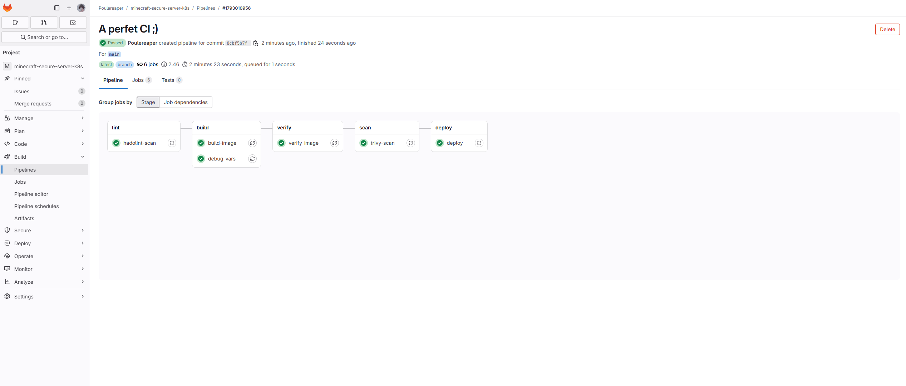

On commence par vérifeir que notre pod tourne bien :

```bash
kubectl get svc -n minecraft
```
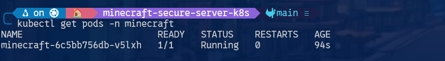

En vérfiant les logs on voit bien que le server est créé :
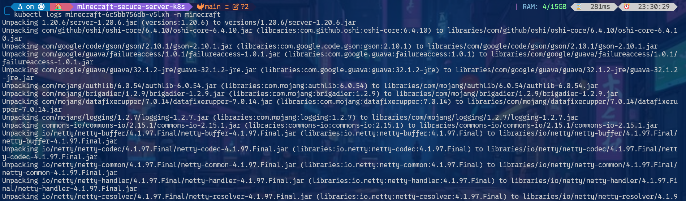
...
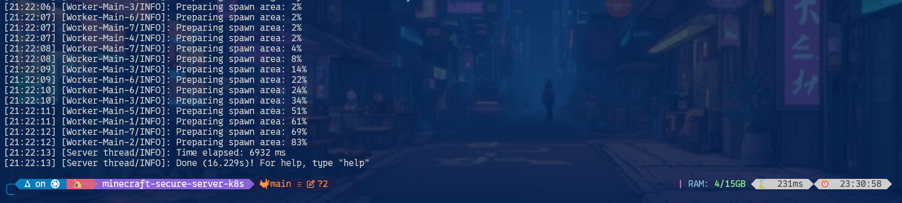

On essaie par la suite de se connecter à notre server sur Minecraft avec `localhost:30565`. Malheureusement mon port forwarding entre mon WSL et mon windows ne semblmlait pas marcher malgré mes efforts. Le server Minecraft est pourtant créé et run.

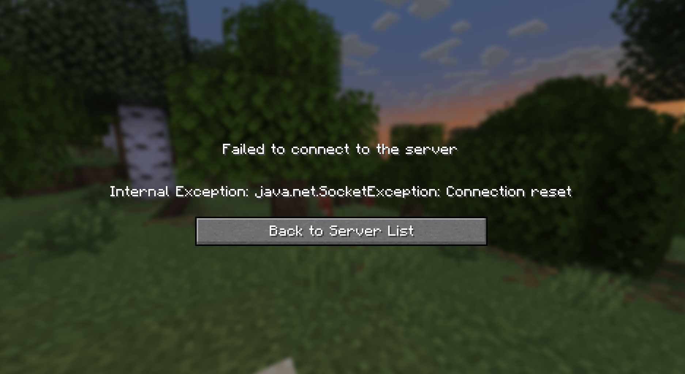


### Points Bonus ✨

- **Network Policies** : Restreindre l'accès au pod Minecraft *3 points*

- **Vault Integration** : Gérer les secrets du serveur (mot de passe RCON) *5 points*

- **Falco Monitoring** : Détecter les tentatives de cheat in-game *3 points*

- **Auto-scaling** : Scale up/down avec HPA selon le nombre de joueurs *10 points*
