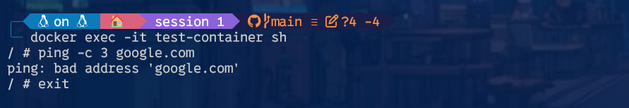

# Session 1

## Activités Pratiques - Introduction aux Containers et à la Sécurité

**1. Lancer un Container Simple**

- Installer Docker si ce n’est pas déjà fait.
- Exécuter un container de test :
```bash
  docker run --rm hello-world
```

- Observer les logs affichés et comprendre les étapes du lancement du container.


```bash
docker run --rm hello-world
Unable to find image 'hello-world:latest' locally
latest: Pulling from library/hello-world
e6590344b1a5: Pull complete
Digest: sha256:7e1a4e2d11e2ac7a8c3f768d4166c2defeb09d2a750b010412b6ea13de1efb19
Status: Downloaded newer image for hello-world:latest

Hello from Docker!
This message shows that your installation appears to be working correctly.

To generate this message, Docker took the following steps:
 1. The Docker client contacted the Docker daemon.
 2. The Docker daemon pulled the "hello-world" image from the Docker Hub.
    (amd64)
 3. The Docker daemon created a new container from that image which runs the
    executable that produces the output you are currently reading.
 4. The Docker daemon streamed that output to the Docker client, which sent it
    to your terminal.

To try something more ambitious, you can run an Ubuntu container with:
 $ docker run -it ubuntu bash

Share images, automate workflows, and more with a free Docker ID:
 https://hub.docker.com/

For more examples and ideas, visit:
 https://docs.docker.com/get-started/
```

1. Docker recherche l’image hello-world en local.
2. Si l’image n’est pas trouvée, il la télécharge depuis Docker Hub.
3. Docker crée un container et exécute l’image.
4. Un message s’affiche confirmant que Docker fonctionne correctement.
5. Une fois terminé, le container est supprimé (--rm supprime automatiquement le container après l’exécution).

**2. Explorer un Container en Interactif**

- Lancer un container interactif basé sur alpine :
```bash
docker run -it --rm alpine sh
```
- Tester des commandes Linux dans le container (ls, pwd, whoami).


- `-it` : Mode interactif (permet d’échanger avec le terminal du container).
- `--rm` : Supprime le container après fermeture.
- `alpine` : Image légère basée sur Linux Alpine.
- `sh` : Ouvre un shell interactif.

Pour quitter et par conséquent supprimer notre conteneur on tape `exit`


**3. Analyser les ressources système d’un container**

- Lancer un container et surveiller ses ressources :
```bash
docker run -d --name test-container nginx
docker stats test-container
```
- Observer la consommation de CPU et mémoire.


- CPU % : Pourcentage d’utilisation CPU.
- MEM USAGE / LIMIT : Mémoire consommée et limite.
- NET I/O : Trafic réseau du container.
- BLOCK I/O : Entrées/sorties disque.
- PIDS : Nombre de processus actifs dans le container.

Pour arrêter et supprimer le container après test :

```bash
docker stop test-container && docker rm test-container
```

**4. Lister les capacités d’un container**


Vérifier les permissions :
```bash
docker run --rm --cap-add=SYS_ADMIN alpine sh -c 'cat /proc/self/status'
```


- `--cap-add=SYS_ADMIN` : Ajoute la capacité SYS_ADMIN, qui permet d’exécuter certaines opérations administratives.
- `cat /proc/self/status` : Affiche les informations du processus en cours, dont les capacités assignées.


Par défaut, Docker limite les permissions d’un container pour réduire les risques. Donc ajouter des capacités augmente la surface d’attaque en cas d’exploitation.

## Activités Pratiques - Vulnérabilités et Menaces

**1. Tester un Container avec des Permissions Élevées**

- Lancer un container en mode privilégié et exécuter une commande système :
```bash
docker run --rm --privileged alpine sh -c 'echo hello from privileged mode'
```
- Observer pourquoi cette pratique est dangereuse.


- `--privileged` donne un accès total aux périphériques et au noyau.
- Un container privilégié peut modifier l’hôte, ce qui annule l’isolation.
- Risque d’évasion de container et de compromission de l’hôte.

**2. Simuler une Évasion de Container**

- Lancer un container et monter le système de fichiers de l’hôte :
```bash
docker run --rm -v /:/mnt alpine sh -c 'ls /mnt'
```


- Quelles sont les implications de cette faille de configuration ?

Le container accède au système de fichiers de l’hôte (dans notre cas c'est notre wsl).
Un attaquant pourrait lire, modifier ou supprimer des fichiers critiques. et il existe aussi un risque de compromission totale du système hôte.

**3. Créer une Image Sécurisée**

- Écrire un Dockerfile minimaliste :

```dockerfile
FROM alpine
RUN adduser -D appuser
USER appuser
CMD ["echo", "Container sécurisé!"]
```
Voir : ficheir Dockerfile dans le même dossier que ce session1.md

- Construire et exécuter l’image.


- Afficher l'id et l'uid de cet utilisateur


Utiliser un utilisateur non-root limite les dommages en cas d’attaque.
Le container ne peut pas modifier les fichiers critiques de l’hôte.

**4. Restreindre l’accès réseau d’un container**

- Bloquer la connexion internet dans un container :
```bash
docker network disconnect bridge mon-container
```
- Tester l’accès internet avec par exemple `ping google.com.`

Pour ce test, on démarre un container
```bash
docker run -d --name test-container alpine sleep 1000
```
On test une permière fois `ping google.com.`
```bash
docker exec -it test-container sh
```
Puis
```bash
ping -c 3 google.com
```


Le ping fonctionne car le container est nativement connecté au réseau.

On déconnecte le container du réseau :
```bash
docker network disconnect bridge test-container
```


Et on test de nouveau`ping google.com.`
```bash
docker exec -it test-container sh
```
Puis
```bash
ping -c 3 google.com
```


Le ping échoue car le container n’a plus accès au réseau.
Le résultat "bad address" correspond probablement à un message automatique lorsque le ping échoue de cette manière.Cette solution permet de limiter les connexions sortantes et renforcer la sécurité.

**5. Télécharger et Scanner une Image**

- Télécharger une image vulnérable et l’analyser avec Trivy :
```bash
docker pull vulnerables/web-dvwa
trivy image vulnerables/web-dvwa
```
- Faites un scan et sauvegarder le résultat en json


Pour sauvegarder les résultats en JSON :
```bash
trivy image -f json -o scan_result.json vulnerables/web-dvwa
```
Voir le fichier scan_result.json dans le même dossier que ce session1.md

- Faites un rapide résumé des vulnérabilités de cette image

**1. Analyse réalisée par une IA sur le fichié scan_result.json (Il faut bien en utiliser un peu)**

*Système obsolète* : 
- Debian 9.5 n'est plus maintenu (EOL - End of Life), ce qui signifie que cette distribution ne reçoit plus de mises à jour de sécurité officielles.

*Vulnérabilités critiques (CVEs) détectées* :

- CVE-2019-10082 : Vulnérabilité dans Apache HTTP Server permettant une lecture après libération de mémoire, pouvant entraîner une exécution de code arbitraire.
- CVE-2021-26691 : Débordement de mémoire dans Apache HTTP Server (mod_session) via une requête malveillante.
- CVE-2021-39275 : Écriture hors limites dans Apache HTTP Server (ap_escape_quotes) qui peut être exploitée pour compromettre le système.
- CVE-2021-40438 : Vulnérabilité SSRF (Server-Side Request Forgery) dans le module mod_proxy d'Apache.
- CVE-2021-44790 : Débordement de mémoire tampon dans mod_lua d'Apache HTTP Server.
- CVE-2022-22720 : Vulnérabilité permettant une attaque de "HTTP Request Smuggling".
- CVE-2022-22721 : Débordement de mémoire possible avec un LimitXMLRequestBody trop grand.
- CVE-2022-23943 : Écriture hors limites dans le module mod_sed d'Apache.

*Logiciels affectés* :
- Apache HTTP Server (version 2.4.25-3+deb9u5) : De nombreuses vulnérabilités critiques détectées.
- PHP et MariaDB sont également installés, mais le rapport ne mentionne pas explicitement de vulnérabilités pour ces paquets.

**2. Résumé que nous avons fais avec les derniers logs après `trivy image vulnerables/web-dvwa`**

- CVE-2016-9841, CVE-2016-9843, CVE-2016-9840, CVE-2016-9842 (CRITICAL/HIGH) : Problèmes de gestion des pointeurs en mémoire pouvant conduire à une corruption mémoire et une exécution de code arbitraire.
- CVE-2022-1271 (HIGH) : Vulnérabilité permettant une écriture arbitraire de fichiers en exploitant la commande gzip.
- Problèmes de sécurité liés aux clés privées : 
Un fichier de clé privée a été trouvé dans /etc/ssl/private/ssl-cert-snakeoil.key. Si ce fichier est exposé ou accessible, il peut compromettre les communications chiffrées de l’application.
Recommandation : Ne jamais inclure de clés privées dans une image Docker publique. Remplacez cette clé et utilisez une gestion sécurisée des secrets.


**6. Scanner une Image pour Détecter les Vulnérabilités**

- Analyser une image avec Grype :

```bash
grype alpine:latest
```

- Comparer votre image build avec l'image alpine:latest
- Quelles sont les différences entre grype et trivy ?

## Étude de Cas : Attaque par Élévation de Privilège

- Un attaquant exploite une faille dans un container mal configuré.
- Il parvient à exécuter du code sur l’hôte et récupérer la sauvegarde d'une base de données qui contient des données bancaires.
- Quelles mesures auraient pu empêcher cette attaque ?

### Mesures pour empêcher l'attaque par élévation de privilège

**1. Ne pas utiliser `--privileged`**

Un container en mode privilégié peut presque tout faire sur l’hôte. **Il faut éviter de l’utiliser sauf cas très spécifiques.**

**2. Utiliser un utilisateur `non-root`**

Par défaut, un container tourne en `root`. Créer et utiliser un utilisateur restreint dans le Dockerfile :

```dockerfile
RUN adduser -D appuser  
USER appuser
```

**3. Restreindre les volumes montés**

L’attaquant a récupéré la base de données car le container avait accès aux fichiers de l’hôte. **Ne jamais monter `/` ou d’autres répertoires critiques**.

**4. Utiliser des capacités minimales (`--cap-drop` et `--cap-add`)**

Limiter les capacités du container pour réduire l’impact d’un exploit :

```bash
docker run --rm --cap-drop=ALL --cap-add=NET_BIND_SERVICE mon-container-jsp
```

**5. Restreindre l’accès réseau**

Si un attaquant prend le contrôle du container, il ne doit pas pouvoir se connecter à l’hôte ou exfiltrer des données.

- Utiliser des réseaux isolés (`docker network`)
- Définir des règles avec `iptables` ou `ufw` (basé sur linux)

**6. Scanner les images pour détecter les failles**

Vérifier régulièrement les vulnérabilités des images avec Trivy ou Grype (comme vu dans ce tp)  et les mettre à jour.

```bash
trivy image mon-container-jsp
```
7. Activer le mode "read-only" pour limiter les modifications

Empêche les écritures malveillantes sur le container :

```bash
docker run --rm --read-only my-container
```