### Activités Pratiques  

1. **Déployer un Cluster Kubernetes avec Kind**
> Documentation présente [ici](https://kind.sigs.k8s.io/docs/user/quick-start/)  
- Installer Kind
- Installer [kubectl](https://kubernetes.io/fr/docs/tasks/tools/install-kubectl/)

- Créer un cluster avec 2 master node et 2 worker node avec un l'aide d'un fichier yaml.

On va créer un fichier kind-cluster.yaml pour définir la configuration du cluster. Voir fichier `kind-cluster.yaml` dans le même dossier que ce `session 3`
```yml 
kind: Cluster
apiVersion: kind.x-k8s.io/v1alpha4
nodes:
  - role: control-plane
  - role: control-plane
  - role: worker
  - role: worker
```
Ensuite, lance la création du cluster :
```bash
kind create cluster --config kind-cluster.yaml
```
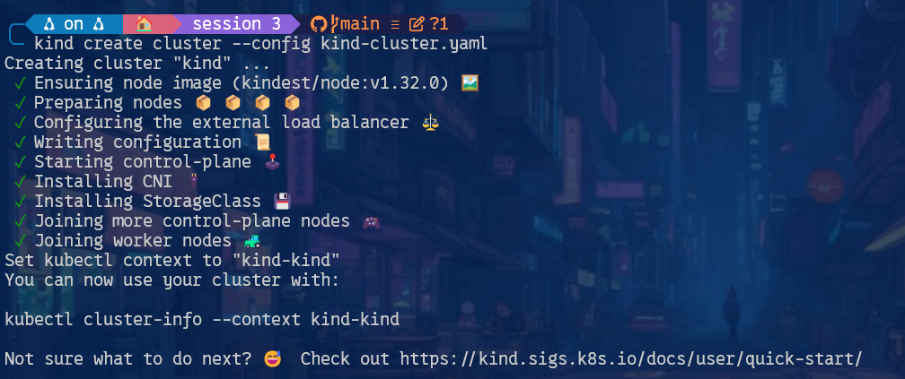

- Vérifier l’état du cluster :
```bash
kubectl get nodes
```

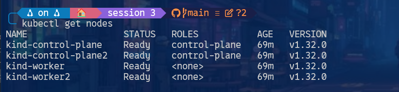

- Comment afficher la liste des namespace ?

Pour afficher la liste des namespaces disponibles dans Kubernetes, nous utilisons la commande suivante :
```bash
kubectl get namespaces
```
OU 
```bash
kubectl get ns
```
Cette commande permet de voir tous les namespaces créés dans le cluster, y compris ceux par défau comme `default`, `kube-system` et `kube-public`.

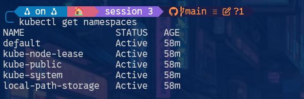

- Quelle version de kubernetes vous avez déployé ?

Pour connaître la version de Kubernetes utilisée, on exécute :
```bash
kubectl version --short
```
Cette commande affiche la version du client `kubectl` ainsi que celle du serveur Kubernetes.

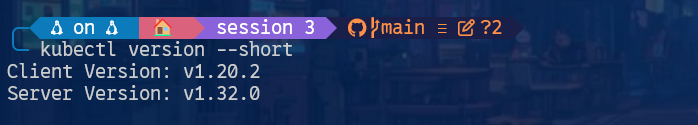

2. **Expérimentation des RBAC**
- Créer un namespace `test-rbac`
```bash
kubectl create ns test-rbac
```

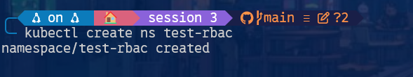

- Déployer ce pod dans le namespace `test-rbac` avec la commande `kubectl apply -f mon-pod.yaml`


```yaml  title="mon-pod.yaml"
apiVersion: v1
kind: Pod
metadata:
name: nginx
namespace: test-rbac
labels:
    app: nginx
spec:
containers:
- name: nginx
    image: nginx
    ports:
    - containerPort: 80
```
Voir le fichier `mon-pod.yaml` dans le même dossier que ce `session 3`.

On applique la configuration :

```bash
kubectl apply -f mon-pod.yaml
```
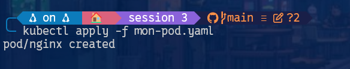

Puis on vérifie que le pod est bien en cours d’exécution :

```bash
kubectl get pods -n test-rbac
```
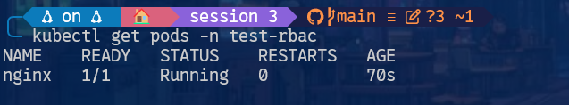

- Comment afficher les logs de ce pod ?
Pour afficher les logs de notre pod on tape cette commande :
```bash
kubectl logs nginx -n test-rbac
```

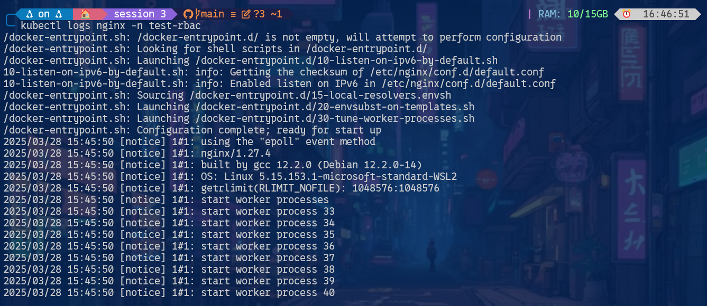

Cette commande permet de voir la sortie standard et les éventuelles erreurs générées par le conteneur dans le pod nginx.

- Créer un role pour lire les pods dans le namespace 
`test-rbac` toujours avec la commande `kubectl apply -f`

```yaml  title="role-pod-reader.yaml"
apiVersion: rbac.authorization.k8s.io/v1
kind: Role
metadata:
    namespace: test-rbac
    name: pod-reader
rules:
- apiGroups: [""]
    resources: ["pods"]
    verbs: ["get", "list"]
```
Voir le fichier `role-pod-reader.yaml` dans le même dossier que ce `session 3`

On applique ce fichier :
```bash
kubectl apply -f role-pod-reader.yaml
```
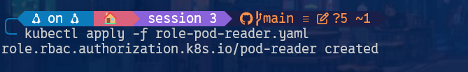

- Comment afficher ce role ?

Pour vérifier les détails du rôle pod-reader, on utilise :
```bash
kubectl get roles -n test-rbac
```
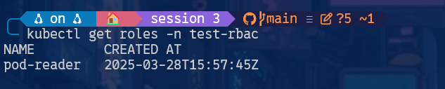

Ou, pour plus de détails :
```bash
kubectl describe roles pod-reader -n test-rbac
```
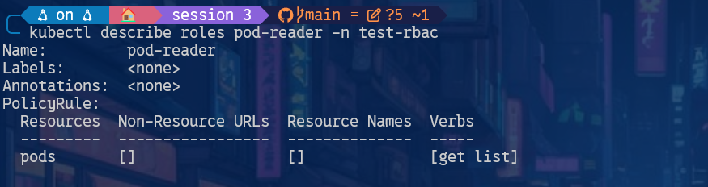

- Ensuite il faut lier ce **Role** avec un utilisateur "fictif" `titi`, appliquer ce fichier avec `kubectl`

```yaml  title="rolebinding-pod-reader.yaml"
apiVersion: rbac.authorization.k8s.io/v1
kind: RoleBinding
metadata:
name: read-pods-binding
namespace: test-rbac
subjects:
- kind: User
name: xixi
apiGroup: rbac.authorization.k8s.io
roleRef:
kind: Role
name: pod-reader
apiGroup: rbac.authorization.k8s.io
```
Voir le fichier `rolebinding-pod-reader.yaml` dans le même dossier que ce `session 3`

On applique ce fichier :
```bash
kubectl apply -f rolebinding-pod-reader.yaml
```

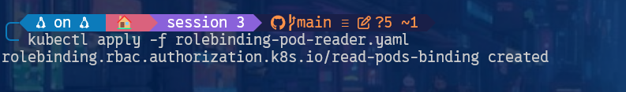

- Il faut créer l'utilisateur `titi` (pour notre tp nous avons changé titi en `xixi`) dans le cluster maintenant, parce que par défaut vous avez un compte admin avec les clés localisées ici `~/.kube/config`

```bash
docker cp kind-control-plane:/etc/kubernetes/pki/ca.crt .
docker cp kind-control-plane:/etc/kubernetes/pki/ca.key .
```  
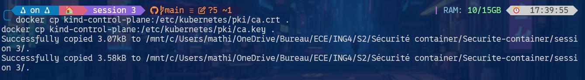

Voir les fichiers `ca.crt` et `ca.key`dans le même dossier que ce `session 3`

`kind-control-plane` est le nom du container créer par kind à adapter si besoin.  
```bash
openssl genrsa -out xixi.key 2048
openssl req -new -key xixi.key -out xixi.csr -subj "/CN=xixi"
openssl x509 -req -in xixi.csr -CA ca.crt -CAkey ca.key -CAcreateserial -out xixi.crt -days 365
```  

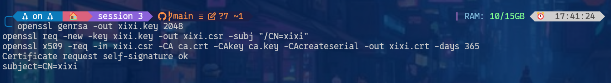

Voir les fichiers `xixi.crt`,  `xixi.key`et `xixi.csr` dans le même dossier que ce `session 3`

- Ajouter cet utilisateur dans le kube context  
```bash
kubectl config set-credentials xixi \
--client-certificate=xixi.crt \
--client-key=xixi.key
```  

- Créer un contexte pour xixi dans le namespace test-rbac  
```bash
kubectl config set-context xixi-context \
--cluster=kind-kind \
--namespace=test-rbac \
--user=xixi
```  

- Basculer de contexte
```bash
kubectl config use-context xixi-context
```
!!! tip
`kubectl get ...` `kubectl apply -f monficher.yml` `kubectl logs pod monpod -n namespace`
- Maintenant tester de lister les pods dans le namespace `test-rbac`, pouvez vous le faire ?
- Pouvez-vous créer un pod dans le namespace `test-rbac` ? Si non, quel est le message d'erreur ?
- Remettez vous dans le contexte `kind-kind`

3. **Scanner un Cluster Kubernetes avec Kube-Bench**
- Faite un scan de votre cluster avec l'outil [kube-bench](https://aquasecurity.github.io/kube-bench/v0.9.0/)
- Créer un job avec `kubectl apply -f job.yml` comme expliqué dans la documentation
- Donner un rapide résumé de ce bench

!!! 🔥tip
Pour déployer falco il faut `helm` installé sur votre machine. Helm permet de deployer des workloads dans kubernetes.

4. **Détection et alerte d'intrusions dans kubernetes avec l'outil Falco**  
- Ajouter le repo helm et faire un update
```bash
helm repo add falcosecurity https://falcosecurity.github.io/charts
helm repo update
```  
- Créer un namespace falco 
```bash
kubectl create ns falco
```  
- Installer la chart `falco` dans le namespace `falco` et ici on active *falcosidekick* pour avoir une UI.
```bash
helm -n falco install falco falcosecurity/falco --set falcosidekick.enabled=true --set falcosidekick.webui.enabled=true
```
- Vérifier que vos pods soit `running`, cela peut prendre 2 minutes
```bash
kubectl get pods -n falco
```
- Ouvrez un nouveau shell, dans celui ci faites un port forward afin d'afficher l'UI `http://127.0.0.1:2802` de falco dans votre navigateur 
```bash
kubectl port-forward svc/falco-falcosidekick-ui 2802:2802 --namespace falco
```  
5. **Falco en pratique**

- Il n'y a pas beaucoup d'activités sur le cluster (pod), pour y remédier on va installer un pod avec `kubectl apply -f `  
```yaml title="mon-pod.yml"
apiVersion: v1
kind: Pod
metadata:
    labels:
    app: front
    name: front
spec:
    containers:
    - image: alpine
    name: front
    command:
    - /bin/sh
    - -c
    - sleep 1d
```  

- Executer un shell dans le pod afin de générer une alerte consultable via l'interface de falco.
```bash
kubectl exec -it front -- sh
```
- Est-ce que vous avez une alerte concernant cette action ? Si oui, quelle est sa priorité ? Et la règle ?

- Toujours dans le shell du pod, générer une requête sur l'API Kubernetes
```bash
apk add curl
curl -k http://10.96.0.1:80
```
- Est-ce que vous avez une alerte concernant cette action ? Si oui, quelle est sa priorité ? Et la règle ?

!!! 🔥tip
Maintenant vous êtes des pros de Kubernetes et de la surveillance de celui-ci :fontawesome-regular-face-laugh-wink:
