## Session 4 : Sécurité dans la CI/CD

#### Activités Pratiques

> Créer un projet dans gitlab

1. **Générer une paire de clés**

```bash
  # Installation de cosign
curl -sSfL https://github.com/sigstore/cosign/releases/latest/download/cosign-linux-amd64 -o cosign && chmod +x cosign

./cosign generate-key-pair  # Choisir une passphrase
```

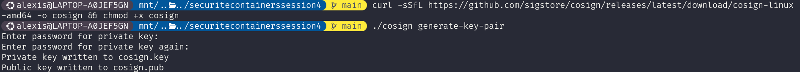

2. **Signer une image Docker et la pousser vers GitLab**

```bash
# Build et tag de l'image
docker build -t registry.gitlab.com/ashtaggg/securitecontainerssession4:v1 .

# Login dans le registry de gitlab avec un personal access token
docker login registry.gitlab.com

# Push de l'image
docker push registry.gitlab.com/ashtaggg/securitecontainerssession4:v1

# Signature avec Cosign + clé GPG
./cosign sign --key cosign.key registry.gitlab.com/ashtaggg/securitecontainerssession4:v1
```

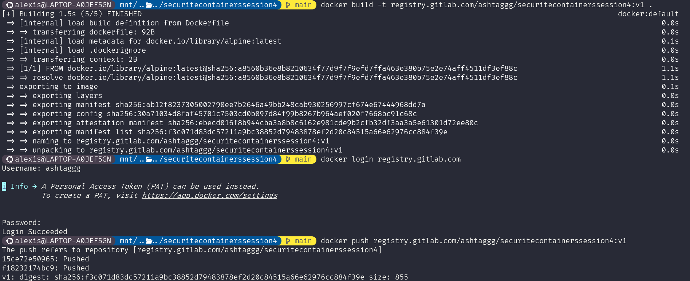
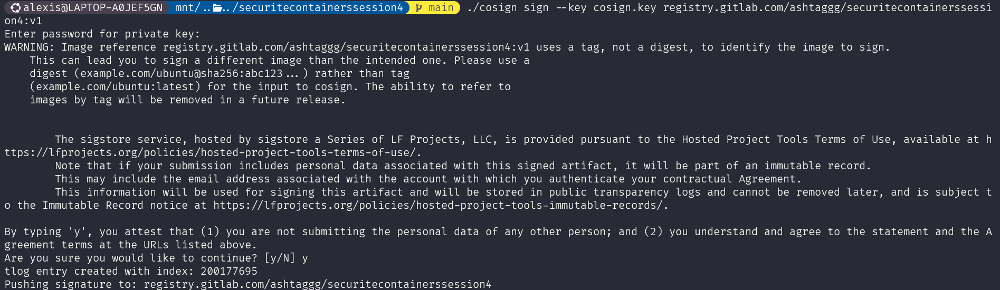

3. **Modifier l'image et pousser une version modifiée**

```bash
# Créer une modification (ex: ajouter un fichier vide)
docker run -it --rm registry.gitlab.com/ashtaggg/securitecontainerssession4:v1 touch /tampered

# Committer la modification et pousser
docker commit $(docker ps -lq) registry.gitlab.com/ashtaggg/securitecontainerssession4:v2
docker push registry.gitlab.com/ashtaggg/securitecontainerssession4:v2
```

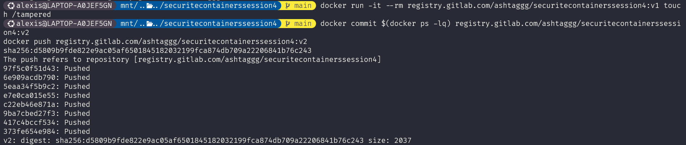

4. **Vérifier la signature avant/après modification**

```bash
# Vérification de l'image originale (doit réussir)
./cosign verify --key cosign.pub registry.gitlab.com/ashtaggg/securitecontainerssession4:v1

# Vérification de l'image altérée (doit échouer)
./cosign verify --key cosign.pub registry.gitlab.com/ashtaggg/securitecontainerssession4:v2
```

- Quelles sont les résultats de ces 2 commandes ?

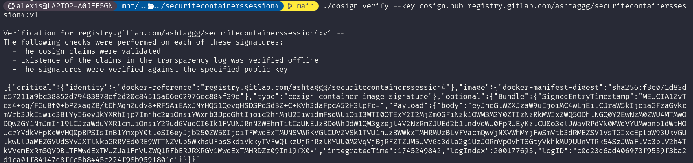
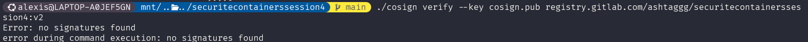

### Sécurité dans les Pipelines CI/CD

### Activités Pratiques

1. **Créer un pipeline CI/CD avec Gitlab CI**

   - Créer le fichier `Dockerfile` dans votre projet

   ```Dockerfile title="Dockerfile"
   FROM alpine:3.21.3
   RUN apk add --no-cache curl=8.12.1-r1
   ```

   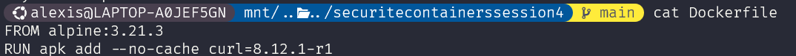

   - Créer le fichier `.gitlab-ci.yml` dans votre projet  
     :warning: Remplacer dans l'étape 3 les **_xxx_** `https://gitlab.com/xxx/xxx//.gitlab-ci.yml@refs/heads/main` par `mon-user/mon-projet`:

   ```yaml title=".gitlab-ci.yml"
   stages:
     - lint
     - build
     - verify
     - scan

     # Étape 1 : Scan du Dockerfile avec Hadolint
   hadolint-scan:
     stage: lint
     image: hadolint/hadolint:latest-debian
     script:
       - hadolint --failure-threshold warning Dockerfile

     # Étape 2 : Build de l'image et cosign l'image
   build-image:
     stage: build
     variables:
       COSIGN_YES: "true" # Used by Cosign to skip confirmation prompts for non-destructive operations
       DOCKER_IMAGE_NAME: $CI_REGISTRY_IMAGE:$CI_COMMIT_REF_SLUG
     id_tokens:
       SIGSTORE_ID_TOKEN: # Used by Cosign to get certificate from Fulcio
         aud: sigstore
     image: docker:cli
     services:
       - docker:dind
     script:
       - echo "$CI_REGISTRY_PASSWORD" | docker login $CI_REGISTRY -u $CI_REGISTRY_USER --password-stdin
       - docker build -t $DOCKER_IMAGE_NAME .
       - docker push $DOCKER_IMAGE_NAME
     after_script:
       - apk add --update cosign
       - IMAGE_DIGEST="$(docker inspect --format='{{index .RepoDigests 0}}' "$DOCKER_IMAGE_NAME")"
       - cosign sign "$IMAGE_DIGEST"

     # Étape 3 : Verify image Cosign
   verify_image:
     image: alpine:3.20
     stage: verify
     before_script:
       - apk add --update cosign docker
       - docker login -u "$CI_REGISTRY_USER" -p "$CI_REGISTRY_PASSWORD" $CI_REGISTRY
     script:
       - cosign verify "$CI_REGISTRY_IMAGE:$CI_COMMIT_REF_SLUG" --certificate-identity "https://gitlab.com/Ashtaggg/securitecontainerssession4//.gitlab-ci.yml@refs/heads/main" --certificate-oidc-issuer "https://gitlab.com"

     # Étape 4 : Scan de sécurité avec Trivy
   trivy-scan:
     stage: scan
     variables:
       # No need to clone the repo, we exclusively work on artifacts.  See
       # https://docs.gitlab.com/ee/ci/runners/README.html#git-strategy
       GIT_STRATEGY: none
       TRIVY_USERNAME: "$CI_REGISTRY_USER"
       TRIVY_PASSWORD: "$CI_REGISTRY_PASSWORD"
       TRIVY_AUTH_URL: "$CI_REGISTRY"
       FULL_IMAGE_NAME: $CI_REGISTRY_IMAGE:$CI_COMMIT_REF_SLUG
     image:
       name: aquasec/trivy:latest
       entrypoint: [""]
     needs: ["build-image"]
     script:
       - trivy --version
       - trivy image --severity HIGH,CRITICAL --exit-code 1 --ignore-unfixed $CI_REGISTRY_IMAGE:$CI_COMMIT_REF_SLUG
   ```

   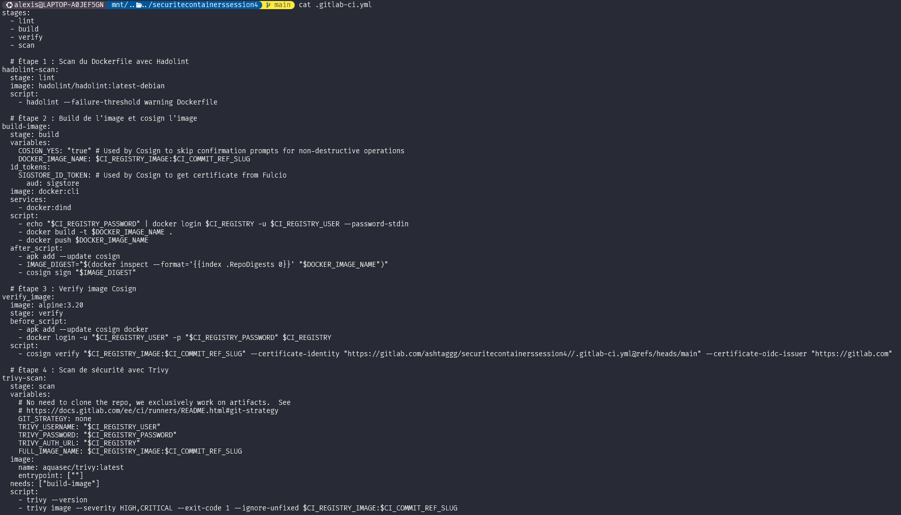

   - Faite un `git push` et observer votre pipeline. Tout est passé ? Faite un rapide résumé des étapes.

   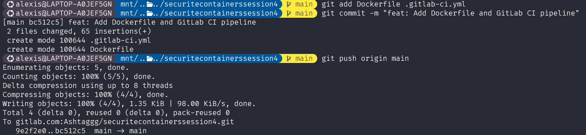
   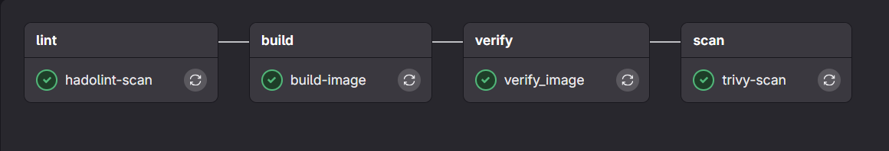

- Simulation d'une Vulnéribilité dans le `Dockerfile`;

  ```Dockerfile title="Dockerfile"
  FROM alpine:3.12
  RUN apk add --no-cache curl=7.79.1-r1
  ```

  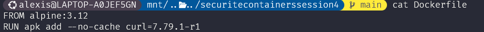

- Maintenant, faites un `git commit` et un `git push`. La pipeline échoue à quelle étape ? Pourquoi ?

  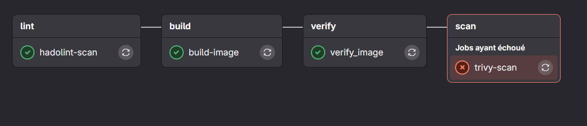
